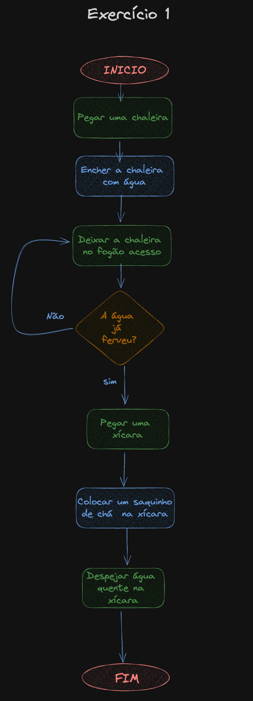
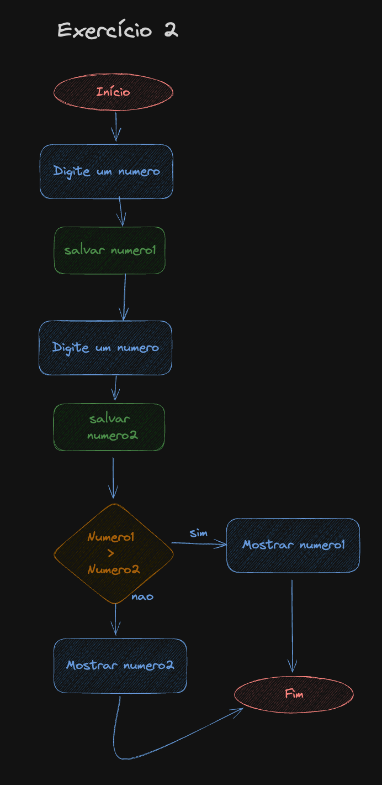
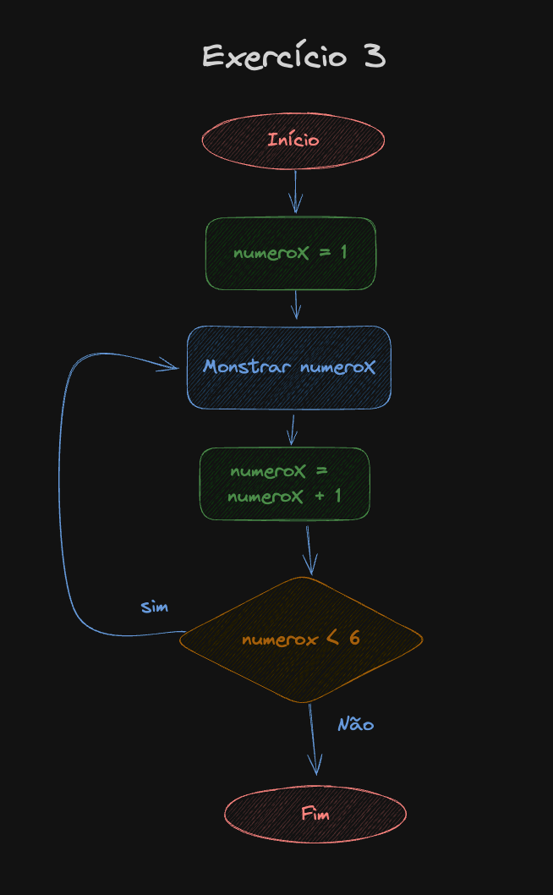
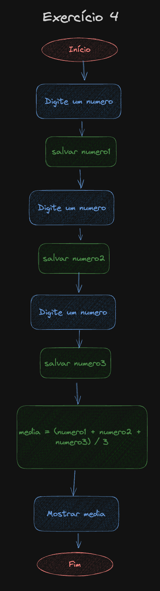
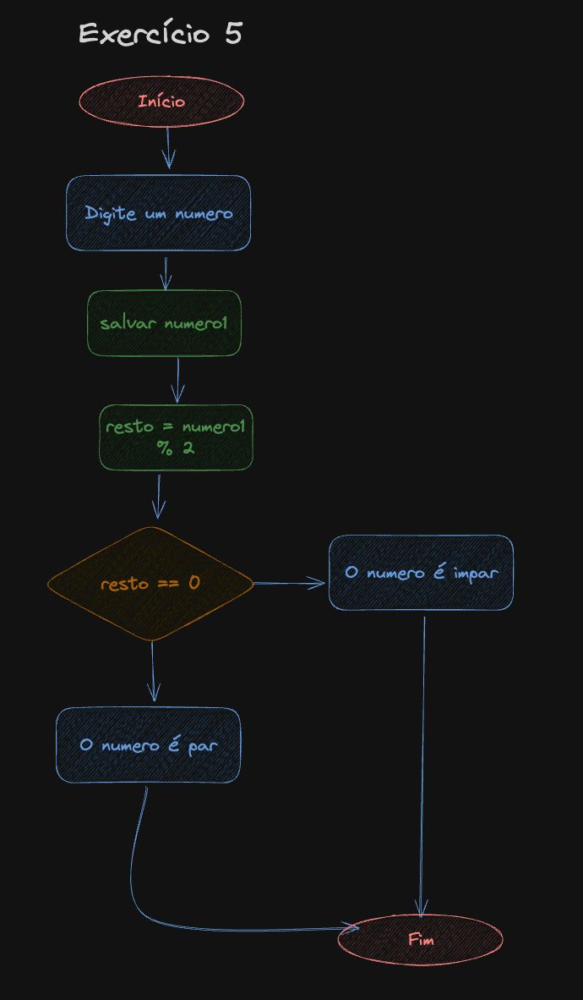
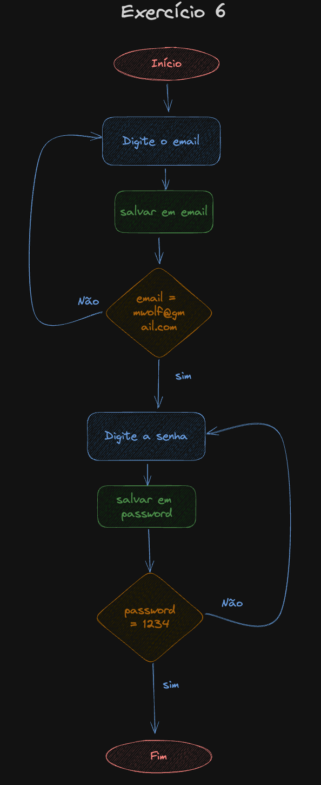
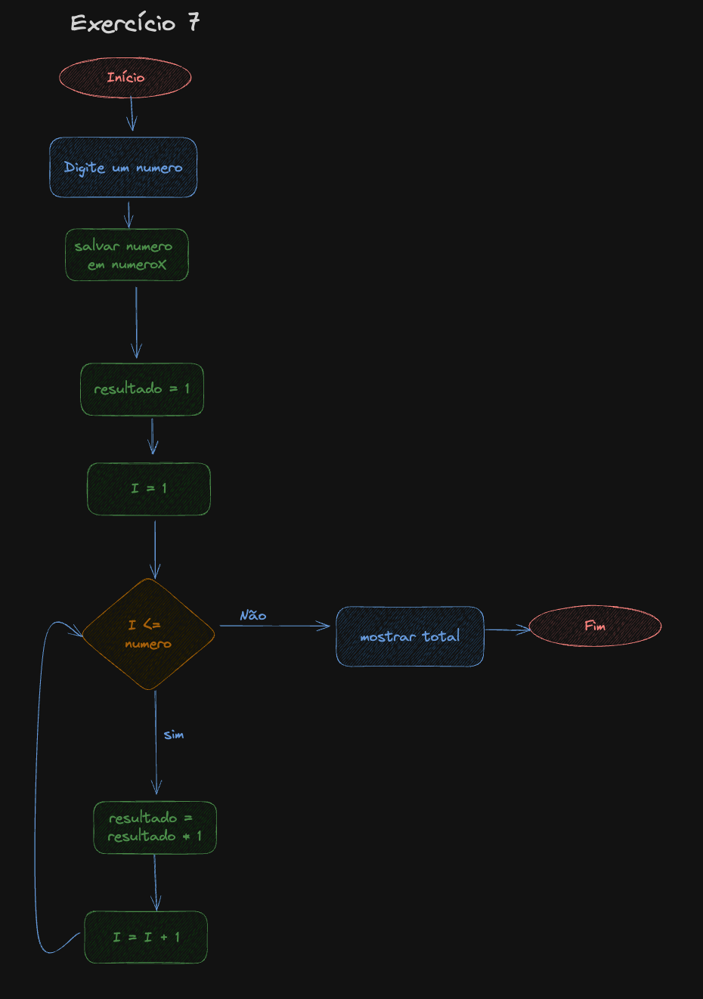
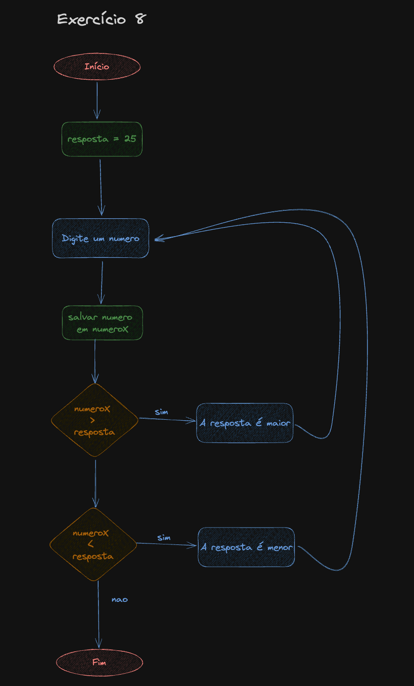

# Aprendendo a programar - Fluxogramas

## Descrição

Este repositório contém informações e recursos relacionados a fluxogramas. Os fluxogramas são representações visuais de processos ou sistemas, utilizando símbolos gráficos para representar etapas, decisões, e fluxo de dados. Eles são amplamente utilizados para documentar, analisar e otimizar processos em diversas áreas, como desenvolvimento de software, engenharia, negócios, entre outros.

## Elementos do fluxograma

Aqui estão algumas formas geométricas comuns em fluxogramas:

1. **Terminal (oval):** Representa o início ou o fim do processo.
2. **Processo (retângulo):** Representa uma operação ou ação a ser executada.
3. **Decisão (losango):** Representa uma condição que determina o fluxo do programa.
4. **Entrada/Saída (paralelogramo):** Representa a entrada ou saída de dados.
5. **Conector (círculo):** Indica onde o fluxo continua em outra parte do fluxograma.

**Como esse repositório usou a ferramenta excalidraw para criar os fluxogramas não é possível usar o paralelogramo para identificar Entrada/Saída de dados, então esta sendo representado por um losangulo azul!**


## Exercícios

Aqui estão alguns exercícios para praticar a criação de fluxogramas. Você pode usar o [excalidraw](https://excalidraw.com/) para criar os fluxogramas.  
Para cada exercício existe uma solução em pseudo-código ou em JavaScript, reparem que a função `prompt` é utilizada para receber dados do usuário, essa função só vai funcionar se for utilizada no browser. Para mais informações sobre a função `prompt` acesse [este link](https://developer.mozilla.org/pt-BR/docs/Web/API/Window/prompt).

### **Exercício 1:**

Escreva um fluxograma que represente o processo de fazer uma xícara de chá.

<details>
  <summary>Solução</summary>



```javascript
// Exemplo de pseudo-código
1 - início
2 - pegar uma chaleira
3 - encher a chaleira com água
4 - deixar a chaleira no fogão acesso
5 - A água já ferveu ?
    NÃO:
      voltar para o passo 4
    SIM:
6 -   pegar uma xícara
7 -   colocar um saquinho de chá na xícara
8 -   despejar a água quente na xícara
9 - fim
```

</details>
<hr/>

### **Exercício 2:**

Crie um fluxograma para encontrar o maior de dois números.

<details>
  <summary>Solução</summary>



```javascript
// Exemplo de código em JavaScript
function maior() {
  const a = Number(prompt("Digite um número"));
  const b = Number(prompt("Digite outro número"));
  if (a > b) {
    console.log(a);
  } else {
    console.log(b);
  }
}
```

</details>

<hr/>

### **Exercício 3:**

Elabore um fluxograma que represente um loop que imprima os números de 1 a 5.

<details>
  <summary>Solução</summary>



```javascript
// Exemplo de código em JavaScript
function imprimirNumeros() {
  let numeroX = 1;
  // numeroX < 6 para que o loop seja executado 5 vezes
  while (numeroX < 6) {
    console.log(numeroX);
    numeroX = numeroX + 1;
    //numeroX +=1
    //numeroX++
  }
}
```

</details>

<hr/>

### **Exercício 4:**

Desenvolva um fluxograma para calcular a média de três números.

<details>
  <summary>Solução</summary>



```javascript
// Exemplo de código em JavaScript
function media() {
  const a = Number(prompt("Digite um número"));
  const b = Number(prompt("Digite outro número"));
  const c = Number(prompt("Digite mais um número"));
  const media = (a + b + c) / 3;
  console.log(media);
}
```

</details>

<hr/>

### **Exercício 5:**

Crie um fluxograma que represente a verificação se um número é par ou ímpar.

<details>
  <summary>Solução</summary>

O operador `%` retorna o resto da divisão de dois números. Se o resto for 0, o número é par, caso contrário, é ímpar.



```javascript
// Exemplo de código em JavaScript
function parOuImpar() {
  const numero = Number(prompt("Digite um número"));

  if (numero % 2 === 0) {
    consoe.log("par");
  } else {
    console.log("ímpar");
  }
}
```

</details>

<hr/>

### **Exercício 6:**

Desenvolva um fluxograma para um sistema de login que verifica a senha do usuário.

<details>
  <summary>Solução</summary>



```javascript
// Exemplo de código em JavaScript
function login() {
  const password = "1234";
  const email = "mwolf@gmail.com";

  let inputEmail = null;
  let inputPassword = null;
  while (inputEmail !== email) {
    inputEmail = prompt("Digite o email:");
  }

  while (inputPassword !== password) {
    inputPassword = prompt("Digite a senha:");
  }
  console.log("Login realizado com sucesso!");
}
```

</details>

<hr/>

### **Exercício 7:**

Elabore um fluxograma para calcular o fatorial de um número.

<details>
  <summary>Solução</summary>

Fatorial de um número é o produto de todos os números inteiros positivos menores ou iguais a ele. Por exemplo, o fatorial de 5 é (5 x 4 x 3 x 2 x 1) = 120.



```javascript
// Exemplo de código em JavaScript
function fatorial() {
  const numero = Number(prompt("Digite um número"));
  let resultado = 1;
  for (let i = 1; i <= numero; i++) {
    resultado *= i;
  }
  console.log(resultado);
}
```

</details>

<hr/>

### **Exercício 8:**

Desenvolva um fluxograma para um jogo simples de adivinhação, onde o usuário tenta adivinhar um número.

<details>
  <summary>Solução</summary>



```javascript
// Exemplo de código em JavaScript
function adivinhar() {
  const resposta = 25;
  let palpite = null;

  while (palpite !== resposta) {
    palpite = Number(prompt("Qual é o seu palpite?"));
    if (resposta < palpite) {
      console.log("Muito alto!");
    } else {
      if (resposta > palpite) {
        console.log("Muito baixo!");
      } else {
        console.log("Acertou!");
      }
    }
  }
}
```

</details>

## Conecte-se Comigo 🌐

- **LinkedIn:** [Murillo Wolf](https://www.linkedin.com/in/murillo-wolf-dev/)

  - Vamos nos conectar no LinkedIn! Compartilharei insights e atualizações regulares sobre [área de atuação].

- **Instagram:** [Wolves.dev](https://www.instagram.com/wolves.dev/)

  - Siga-me no Instagram para acompanhar os bastidores, novidades e momentos divertidos do meu dia a dia.

- **YouTube:** [Murillo Wolf](https://www.youtube.com/@murillowolf3485)
  - Siga-me no Instagram para acompanhar os bastidores, novidades e momentos divertidos do meu dia a dia.
