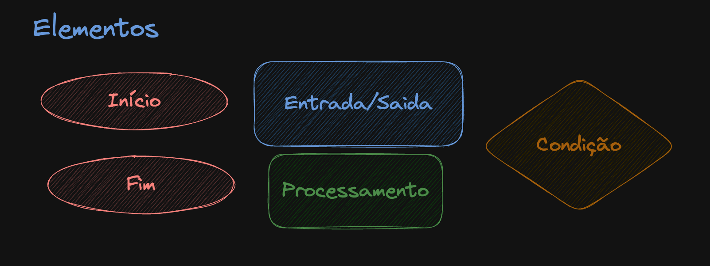

# Aprendendo a programar - Fluxogramas

## Descrição

Este repositório contém informações e recursos relacionados a fluxogramas. Os fluxogramas são representações visuais de processos ou sistemas, utilizando símbolos gráficos para representar etapas, decisões, e fluxo de dados. Eles são amplamente utilizados para documentar, analisar e otimizar processos em diversas áreas, como desenvolvimento de software, engenharia, negócios, entre outros.

## Elementos do fluxograma

Aqui estão algumas formas geométricas comuns em fluxogramas:

1. **Terminal (oval):** Representa o início ou o fim do processo.
2. **Processo (retângulo):** Representa uma operação ou ação a ser executada.
3. **Decisão (losango):** Representa uma condição que determina o fluxo do programa.
4. **Entrada/Saída (paralelogramo):** Representa a entrada ou saída de dados.
5. **Conector (círculo):** Indica onde o fluxo continua em outra parte do fluxograma.

**Como esse repositório usou a ferramenta excalidraw para criar os fluxogramas não é possível usar o paralelogramo para identificar Entrada/Saída de dados, então esta sendo representado por um losangulo azul!**


## Exercícios

### **Exercício 1:**

Escreva um fluxograma que represente o processo de fazer uma xícara de chá.

<details>
  <summary>Solução</summary>

Conteúdo da seção aqui. Pode incluir texto, listas, imagens, etc.

</details>
<hr/>

### **Exercício 2:**

Crie um fluxograma para encontrar o maior de dois números.

<details>
  <summary>Solução</summary>

```javascript
// Exemplo de código em JavaScript
function maior(a, b) {
  if (a > b) {
    return a;
  } else {
    return b;
  }
}
```

</details>

<hr/>

### **Exercício 3:**

Elabore um fluxograma que represente um loop que imprima os números de 1 a 5.

<details>
  <summary>Solução</summary>

```javascript
// Exemplo de código em JavaScript
function imprimirNumeros() {
  for (let i = 1; i <= 5; i++) {
    console.log(i);
  }
}
```

</details>

<hr/>

### **Exercício 4:**

Desenvolva um fluxograma para calcular a média de três números.

<details>
  <summary>Solução</summary>

Conteúdo da seção aqui. Pode incluir texto, listas, imagens, etc.

```javascript
// Exemplo de código em JavaScript
function media(a, b, c) {
  return (a + b + c) / 3;
}

const media = (a, b, c) => (a + b + c) / 3;
```

</details>

<hr/>

### **Exercício 5:**

Crie um fluxograma que represente a verificação se um número é par ou ímpar.

<details>
  <summary>Solução</summary>

O operador `%` retorna o resto da divisão de dois números. Se o resto for 0, o número é par, caso contrário, é ímpar.

```javascript
// Exemplo de código em JavaScript
function parOuImpar(numero) {
  if (numero % 2 === 0) {
    return "par";
  } else {
    return "ímpar";
  }
}
```

</details>

<hr/>

### **Exercício 6:**

Desenvolva um fluxograma para um sistema de login que verifica a senha do usuário.

<details>
  <summary>Solução</summary>

```javascript
// Exemplo de código em JavaScript
function login() {
  const password = "123456";
  const email = "mwolf@gmail.com";

  let inputEmail = null;
  let inputPassword = null;
  while (inputEmail !== email) {
    inputEmail = prompt("Digite o email:");
  }

  while (inputPassword !== password) {
    inputPassword = prompt("Digite a senha:");
  }
  console.log("Login realizado com sucesso!");
}
```

```javascript
}
```

</details>

<hr/>

### **Exercício 7:**

Elabore um fluxograma para calcular o fatorial de um número.

<details>
  <summary>Solução</summary>

Fatorial de um número é o produto de todos os números inteiros positivos menores ou iguais a ele. Por exemplo, o fatorial de 5 é 5 _ 4 _ 3 _ 2 _ 1 = 120.

```javascript
// Exemplo de código em JavaScript
function fatorial(numero) {
  let resultado = 1;
  for (let i = 1; i <= numero; i++) {
    resultado *= i;
  }
  return resultado;
}
```

</details>

<hr/>

### **Exercício 8:**

Desenvolva um fluxograma para um jogo simples de adivinhação, onde o usuário tenta adivinhar um número.

<details>
  <summary>Solução</summary>

```javascript
// Exemplo de código em JavaScript
function adivinhar() {
  const resposta = 42;
  let palpite = null;

  while (palpite !== resposta) {
    palpite = Number(prompt("Qual é o seu palpite?"));
    if (resposta < palpite) {
      console.log("Muito alto!");
    } else {
      if (resposta > palpite) {
        console.log("Muito baixo!");
      } else {
        console.log("Acertou!");
      }
    }
  }
}
```

</details>

## Contato

Para sugestões, dúvidas ou qualquer outra informação, sinta-se à vontade para entrar em contato através das issues ou pelo meu e-mail: [mwolfcavalheiro@gmail.com].

Espero que este repositório seja útil para entender e aplicar fluxogramas em diferentes contextos. Agradecemos por sua contribuição!
